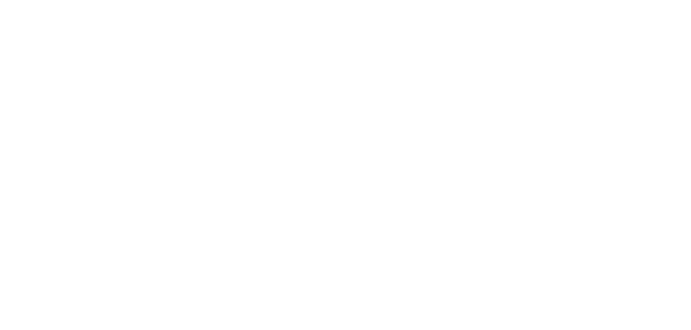
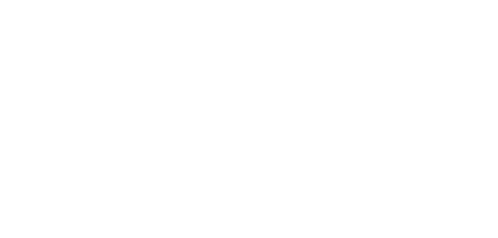

# **Proiettile a rimbalzo**

Lancia il flusso sotto forma di palla, all'impatto con la prima superficie solida rimbalza e prosegue lungo una nuova traiettoria.

| **Bersagli primari** | Secondo oggetto colpito, dopo il rimbalzo |
| **Bersagli secondari** | Primo oggetto colpito in una linea retta |
| **Costo base** | 150 mana |
| **Mod. difesa** | DEX (**solamente dopo il rimbalzo**) |

## Effetto
A contatto con una superficie solida di qualunque tipo, il proiettile rimbalza e prosegue lungo una nuova traiettoria a scelta che origina dal punto di impatto. La gittata percorsa prima del rimbalzo non è contata. Se il proiettile viaggia più a lungo della gittata massima senza colpire un bersaglio si dissipa nell'aria senza effetto.

## Qualità

| Grado 0 | Grado 1 | Grado 2 | Grado 3 | Grado 4 | Grado 5 |
|---|---|---|---|---|
| Gittata 10m | Gittata 20m | Gittata 30m | Gittata 40m | Gittata 50m | Gittata 60m |

## Modello
- ### Grado 1 

- ### Grado 2 

- ### Grado 3 

- ### Grado 4 

- ### Grado 5 
