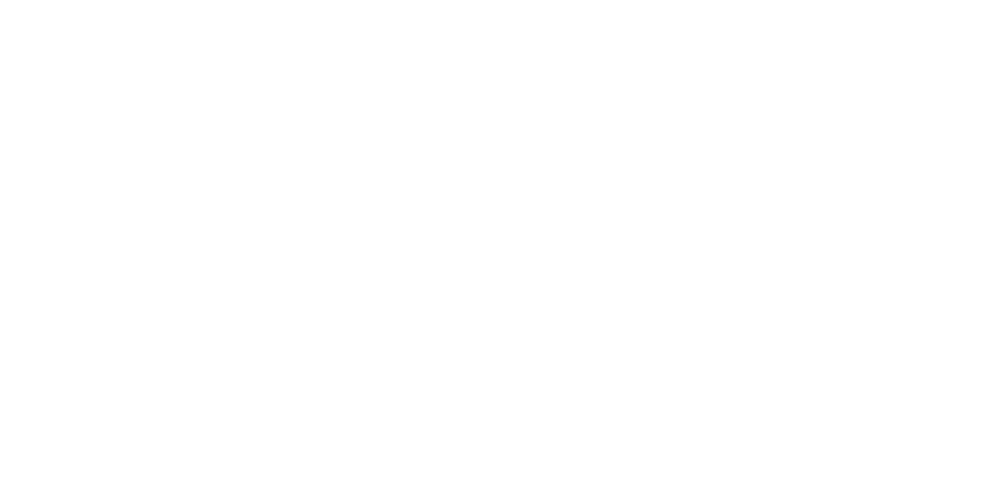

# **Proiettile a rimbalzo**

Lancia un proiettile che rimbalza dopo aver colpito il primo oggetto, continuando a viaggiare e colpendo un secondo bersaglio.

| **Bersagli primari**   | Secondo oggetto colpito dopo il rimbalzo  |
| **Bersagli secondari** | Primo oggetto colpito                     |
| **Costo base per LV**  | 150 mana                                  |
| **Mod. difesa**        | DEX                                       |

## Effetto
Viaggia in linea retta e colpisce il primo oggetto che incontra. Dopo l'impatto, rimbalza e continua il suo percorso in una nuova direzione rettilinea. Se supera la gittata massima senza colpire un secondo bersaglio, si dissipa nell'aria senza ulteriori effetti.

## Qualità

| Grado 0 | Grado 1 | Grado 2 | Grado 3 | Grado 4 | Grado 5 |
|---------|---------|---------|---------|---------|---------|
| Gittata 10m | Gittata 20m | Gittata 30m | Gittata 40m | Gittata 50m | Gittata 60m |

## Modello
- ### Grado 1 
  
- ### Grado 2 
  
- ### Grado 3 
  
- ### Grado 4 
  
- ### Grado 5 
  