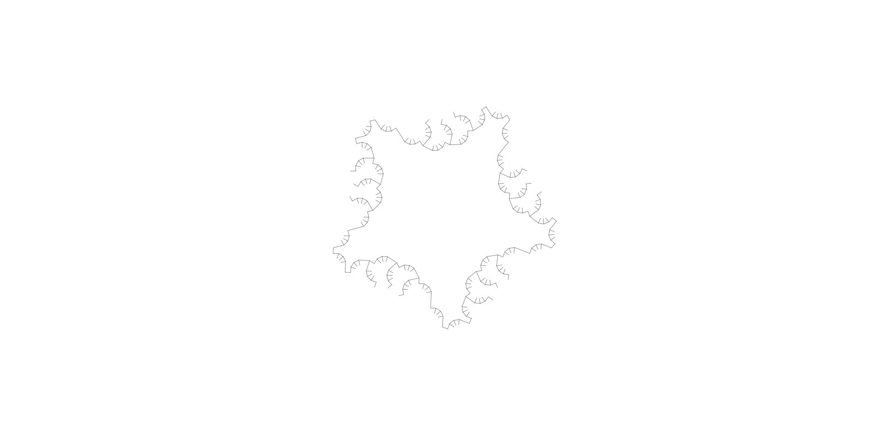
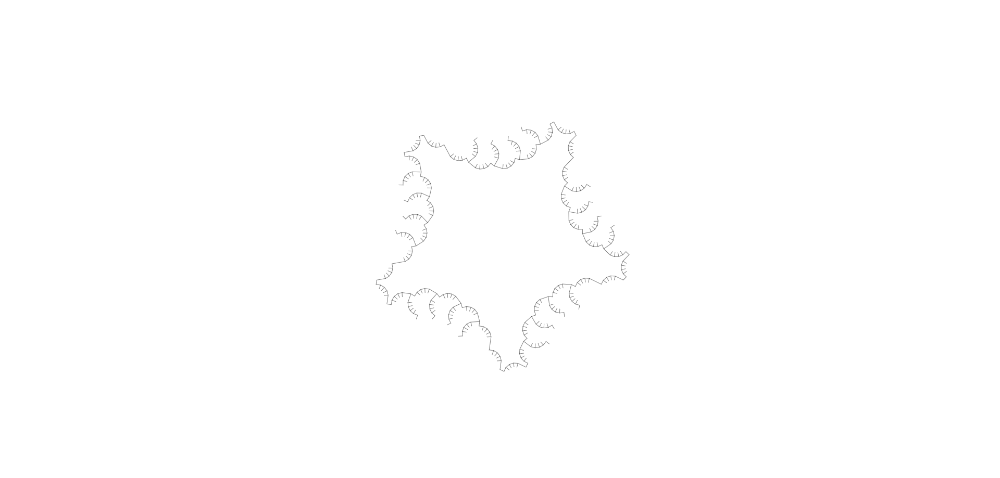

# **Nuvola**

Sparge l'effetto in un'area generando una nube che persiste nel tempo, colpendo le creature al suo interno.

| **Bersagli primari**   | Nessuno                                   |
| **Bersagli secondari** | Tutte le creature all'interno dell'area   |
| **Costo base per LV**  | 700 mana                                  |
| **Mod. difesa**        | CON / ARC                                 |

## Effetto
Genera una nuvola statica che applica gli effetti della sostanza in un'area specificata. Ogni volta che una creatura termina il proprio turno all'interno dell'area, viene colpita come bersaglio secondario. La nuvola rimane statica e non si sposta con il vento o altri fattori esterni.

## Qualità

| Grado 0 | Grado 1 | Grado 2 | Grado 3 | Grado 4 | Grado 5 |
|---------|---------|---------|---------|---------|---------|
| Raggio 1m Durata 1 turno | Raggio 2m Durata 2 turni | Raggio 3m Durata 3 turni | Raggio 4m Durata 4 turni | Raggio 5m Durata 5 turni | Raggio 6m Durata 6 turni |

## Modello
- ### Grado 1 
  
- ### Grado 2 
  
- ### Grado 3 
  
- ### Grado 4 
  
- ### Grado 5 
  