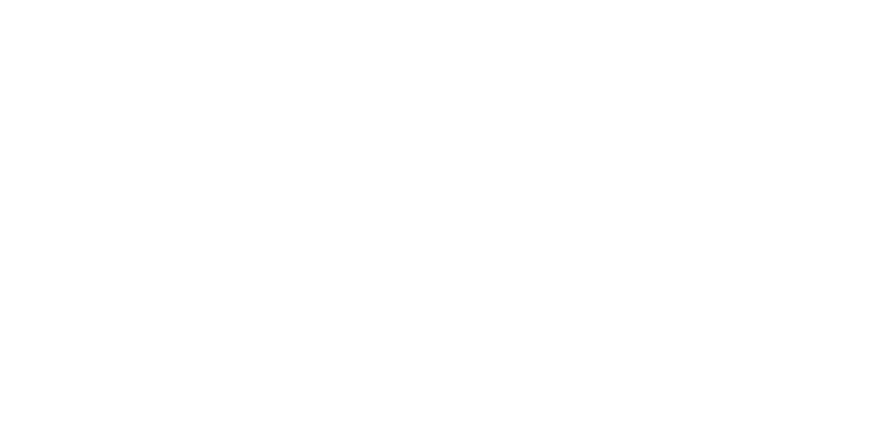
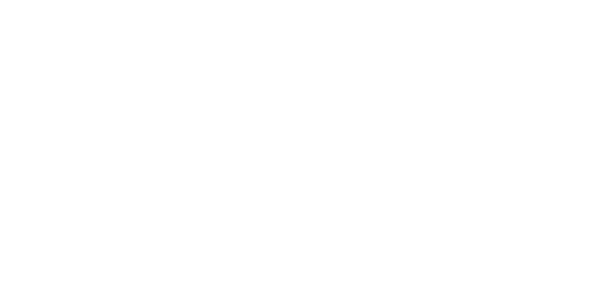
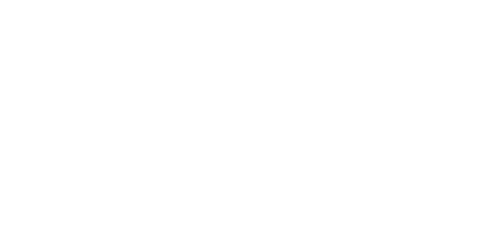

# **Proiettile istantaneo vuoto**

Questa runa non sostituisce la forma dell'evocazione, ma la conserva.
Lancia un proiettile che si teletrasporta sul bersaglio scelto, assumendo immediatamente la forma conservata.

| **Bersagli primari**   | Nessuno                                   |
| **Bersagli secondari** | Bersaglio scelto                          |
| **Costo base per LV**  | 600 mana                                  |
| **Mod. difesa**        | Nessuno                                   |

## Effetto
La runa permette di selezionare un bersaglio entro la gittata. Il proiettile si teletrasporta sulla sua posizione e si trasforma immediatamente nella forma conservata. Il proiettile non può essere bloccato, schivato o cancellato in alcun modo.

## Qualità

| Grado 0 | Grado 1 | Grado 2 | Grado 3 | Grado 4 | Grado 5 |
|---------|---------|---------|---------|---------|---------|
| Gittata 10m | Gittata 20m | Gittata 30m | Gittata 40m | Gittata 50m | Gittata 60m |

## Modello
- ### Grado 1 
  
- ### Grado 2 
  
- ### Grado 3 
  
- ### Grado 4 
  
- ### Grado 5 
  
