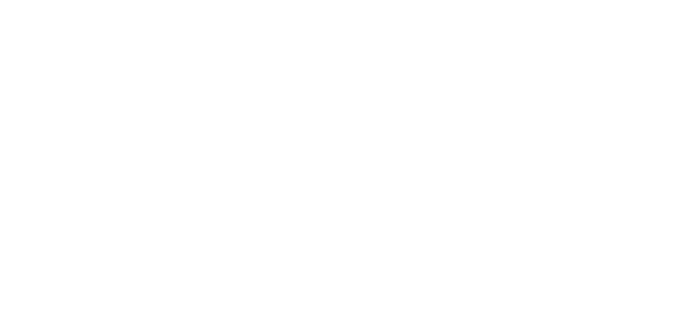

# **Proiettile vuoto**

Lancia un proiettile che colpisce il primo oggetto che trova, assumendo una nuova forma in base alle rune del flusso.

| **Bersagli primari**   | Nessuno                                   |
| **Bersagli secondari** | Primo oggetto colpito in una linea retta  |
| **Costo base per LV**  | 50 mana                                   |
| **Mod. difesa**        | DEX                                       |

## Effetto
Il proiettile viaggia in linea retta e colpisce il primo oggetto che trova. Dopo l'impatto o al raggiungimento della massima gittata, il proiettile assume la forma precedente del flusso, che origina dal punto e nella direzione dell'impatto.

## Qualità

| Grado 0 | Grado 1 | Grado 2 | Grado 3 | Grado 4 | Grado 5 |
|---------|---------|---------|---------|---------|---------|
| Gittata 10m | Gittata 20m | Gittata 30m | Gittata 40m | Gittata 50m | Gittata 60m |

## Modello
- ### Grado 1 
  
- ### Grado 2 
  
- ### Grado 3 
  
- ### Grado 4 
  
- ### Grado 5 
  