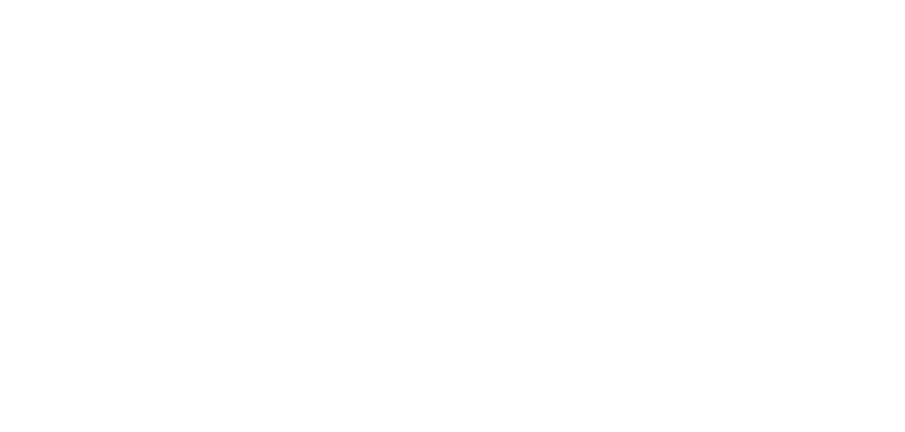

# **Proiettile vuoto**

Assorbe la forma attuale del flusso e la sostituisce con una forma di proiettile sferico.  
All'impatto con qualunque superficie solida si ritrasforma nella runa di forma assorbita.

| **Bersagli primari** | Nessuno |
| **Bersagli secondari** | Primo oggetto colpito in una linea retta |
| **Costo base** | 50 mana |
| **Mod. difesa** | DEX |

## Effetto
All'attivazione assorbe la forma corrente del flusso.
Dopo aver colpito un oggetto o aver raggiunto la massima gittata, ripristina la forma assorbita e la fa originare da punto e direzione di impatto.

## Qualità

| Grado 0 | Grado 1 | Grado 2 | Grado 3 | Grado 4 | Grado 5 |
|---|---|---|---|---|
| Gittata 10m | Gittata 20m | Gittata 30m | Gittata 40m | Gittata 50m | Gittata 60m |

## Modello
- ### Grado 1 

- ### Grado 2 

- ### Grado 3 

- ### Grado 4 

- ### Grado 5 
