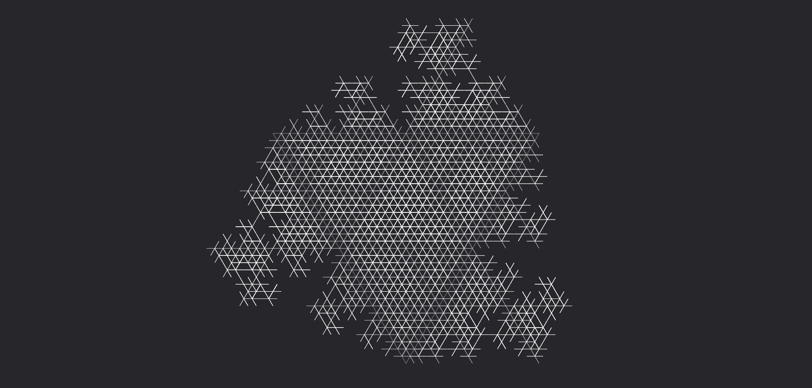

# **Proiettile tracciante**

Marchia un bersaglio e poi lancia un proiettile che lo insegue fino a colpirlo, se non supera la gittata massima.

| **Bersagli primari**   | Bersaglio marchiato                           |
| **Bersagli secondari** | Nessuno                                       |
| **Costo base per LV**  | 300 mana                                      |
| **Mod. difesa**        | Nessuno                                       |

## Effetto
Marchia un bersaglio specifico. Il proiettile lanciato lo insegue fino a colpirlo, schivando gli ostacoli nel percorso. Se supera la gittata senza colpire, si dissipa nell'aria senza produrre ulteriori effetti.

## Qualità

| Grado 0   | Grado 1   | Grado 2   | Grado 3   | Grado 4   | Grado 5   |
|-----------|-----------|-----------|-----------|-----------|-----------|
| Gittata 10m | Gittata 20m | Gittata 30m | Gittata 40m | Gittata 50m | Gittata 60m |

## Modello
- ### Grado 1 
  
- ### Grado 2 
  
- ### Grado 3 
  
- ### Grado 4 
  
- ### Grado 5 
  
