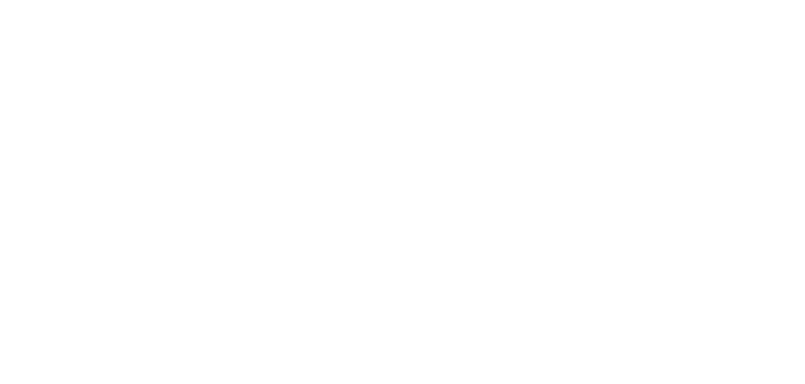

# **Esplosione maggiore**

Genera un'esplosione di larga scala che colpisce ad area, colpendo tutte le creature presenti nel raggio d'azione.

| **Bersagli primari**   | Centro della sfera e entro metà del raggio       |
| **Bersagli secondari** | Creature nell'area e non coperte                 |
| **Costo base per LV**  | 800 mana                                         |
| **Mod. difesa**        | Nessuno                                          |

## Effetto
Esplode dal punto di origine, espandendosi in modo uniforme e colpendo tutte le creature nell'area. L'esplosione ignora coperture minori, ma è bloccata da ostacoli solidi significativi.

## Qualità

| Grado 0 | Grado 1 | Grado 2 | Grado 3 | Grado 4 | Grado 5 |
|---------|---------|---------|---------|---------|---------|
| Raggio 2m | Raggio 4m | Raggio 6m | Raggio 8m | Raggio 10m | Raggio 12m |

## Modello
- ### Grado 1 
  
- ### Grado 2 
  
- ### Grado 3 
  
- ### Grado 4 
  
- ### Grado 5 
  
