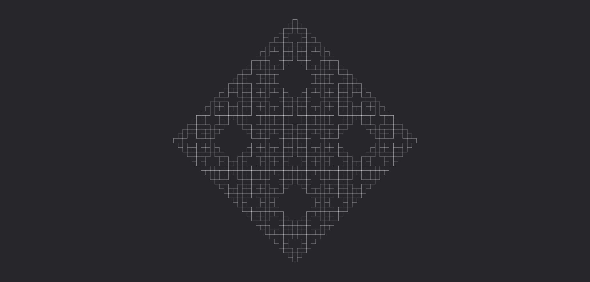
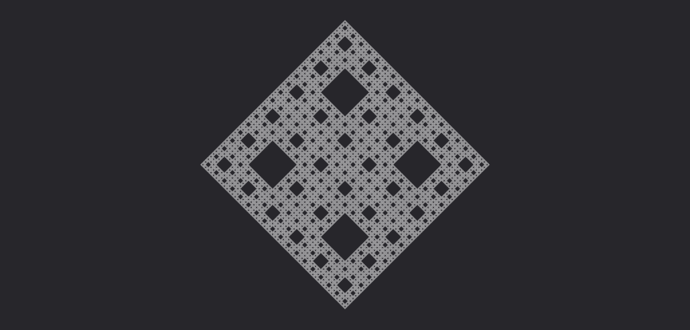

# **Proiettile maggiore**

Un proiettile massiccio che applica i suoi effetti alle creature circostanti durante il volo.

| **Bersagli primari**   | Primo oggetto colpito                     |
| **Bersagli secondari** | Creature entro 1 metro dal proiettile     |
| **Costo base per LV**  | 200 mana                                  |
| **Mod. difesa**        | DEX                                       |

## Effetto
Il proiettile viaggia in linea retta e colpisce il primo oggetto che ne interseca la traiettoria. Mentre è in volo, tutte le creature entro 1 metro dalla sua traiettoria sono considerate bersagli secondari e subiscono gli effetti del proiettile. Se supera la gittata massima senza colpire un bersaglio primario, si dissipa senza produrre ulteriori effetti.

## Qualità

| Grado 0 | Grado 1 | Grado 2 | Grado 3 | Grado 4 | Grado 5 |
|---------|---------|---------|---------|---------|---------|
| Gittata 10m | Gittata 20m | Gittata 30m | Gittata 40m | Gittata 50m | Gittata 60m |

## Modello
- ### Grado 1 
  
- ### Grado 2 
  
- ### Grado 3 
  
- ### Grado 4 
  
- ### Grado 5 
  