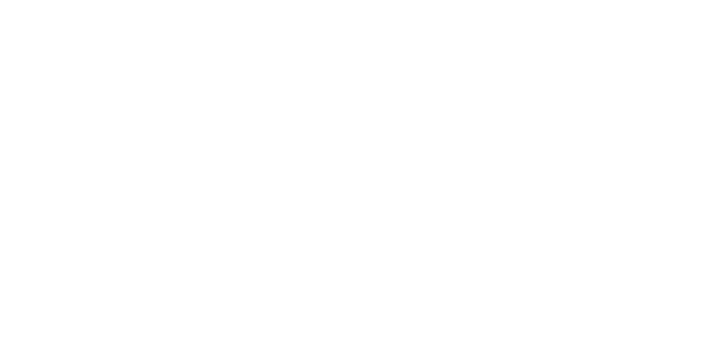

# **Proiettile penetrante**

Lancia un proiettile che viaggia in linea retta, attraversando tutti i bersagli e gli ostacoli minori che incontra.

| **Bersagli primari**   | Primo oggetto colpito                     |
| **Bersagli secondari** | Tutti i bersagli nella traiettoria        |
| **Costo base per LV**  | 200 mana                                  |
| **Mod. difesa**        | DEX                                       |

## Effetto
Il proiettile viaggia in linea retta, attraversando tutti i bersagli e gli ostacoli minori lungo la sua traiettoria. Si dissipa solo se colpisce un ostacolo significativo o alla fine della sua gittata massima.

## Qualità

| Grado 0 | Grado 1 | Grado 2 | Grado 3 | Grado 4 | Grado 5 |
|---------|---------|---------|---------|---------|---------|
| Gittata 10m | Gittata 20m | Gittata 30m | Gittata 40m | Gittata 50m | Gittata 60m |

## Modello
- ### Grado 1 
  
- ### Grado 2 
  
- ### Grado 3 
  
- ### Grado 4 
  
- ### Grado 5 
  
