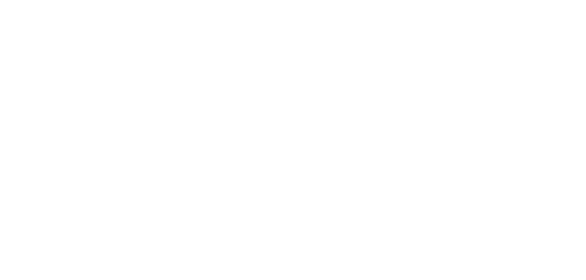
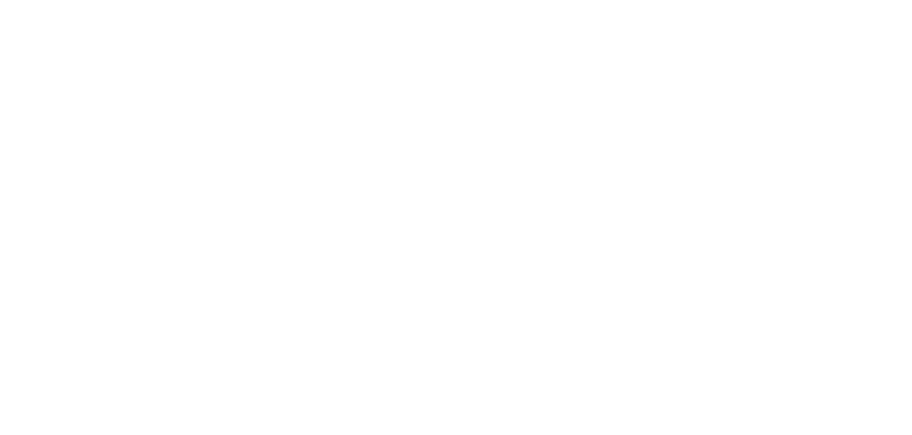

# **Proiettile**

Lancia il flusso sotto forma di palla o freccia, si dissipa all'impatto con qualunque superficie solida.

| **Bersagli primari** | Primo oggetto colpito in una linea retta  |
| **Bersagli secondari** | Nessuno |
| **Costo base** | 100 mana |
| **Mod. difesa** | DEX |

## Effetto
Viaggia in linea retta. Se percorre distanza maggiore della gittata massima si dissipa nell'aria senza effetto.

## Qualità

| Grado 0 | Grado 1 | Grado 2 | Grado 3 | Grado 4 | Grado 5 |
|---|---|---|---|---|
| Gittata 10m | Gittata 20m | Gittata 30m | Gittata 40m | Gittata 50m | Gittata 60m |

## Modello
- ### Grado 1 

- ### Grado 2 

- ### Grado 3 

- ### Grado 4 

- ### Grado 5 
