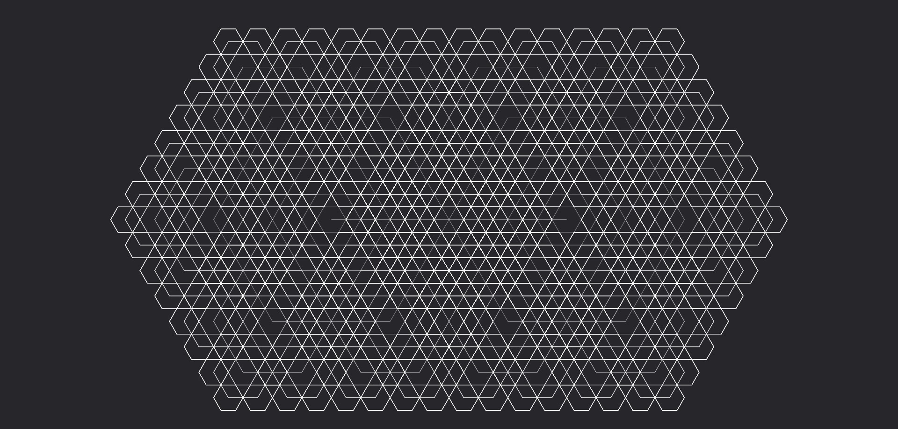

# **Raggio**

Lancia un raggio che prosegue in linea retta, colpendo ogni creatura che attraversa lungo il percorso.

| **Bersagli primari**   | Creature all'interno della traiettoria    |
| **Bersagli secondari** | Nessuno                                   |
| **Costo base per LV**  | 500 mana                                  |
| **Mod. difesa**        | Nessuno                                   |

## Effetto
Si propaga istantaneamente dal punto di origine, colpendo tutte le creature entro la gittata del raggio. Il raggio attraversa le creature ma si dissipa se incontra ostacoli solidi significativi.

## Qualità

| Grado 0 | Grado 1 | Grado 2 | Grado 3 | Grado 4 | Grado 5 |
|---------|---------|---------|---------|---------|---------|
| Gittata 10m | Gittata 20m | Gittata 30m | Gittata 40m | Gittata 50m | Gittata 60m |

## Modello
- ### Grado 1 
  
- ### Grado 2 
  
- ### Grado 3 
  
- ### Grado 4 
  
- ### Grado 5 
  
