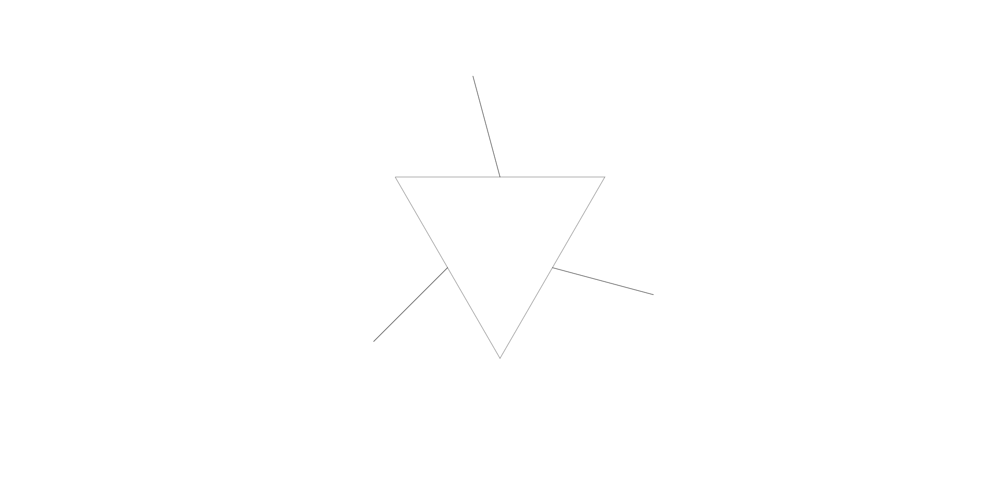
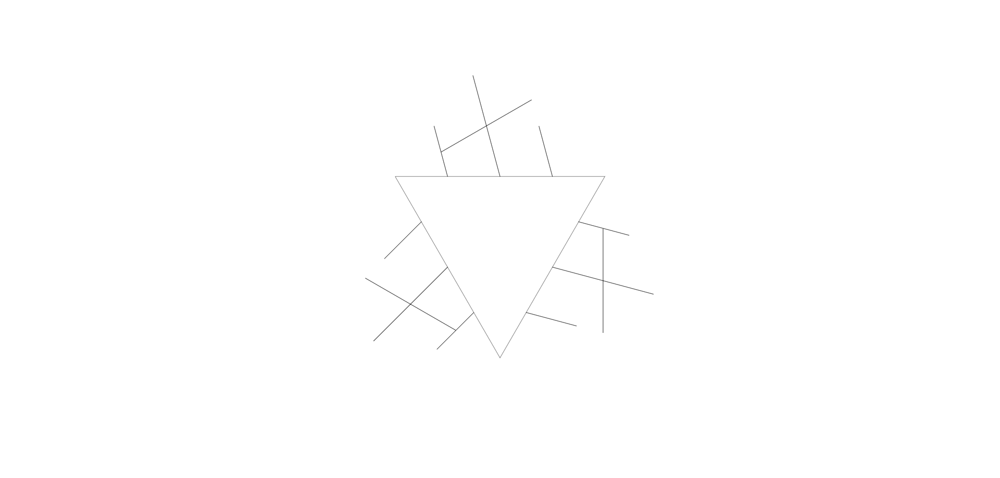
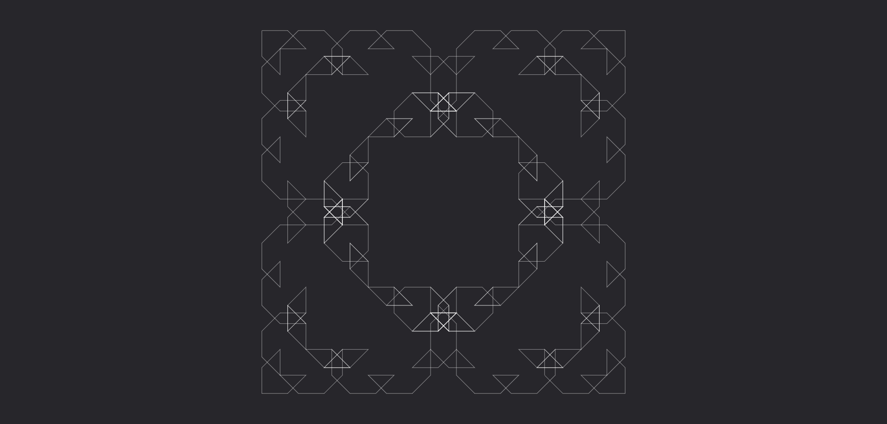
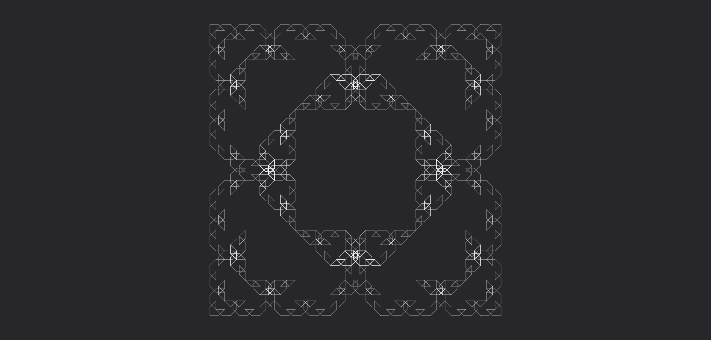
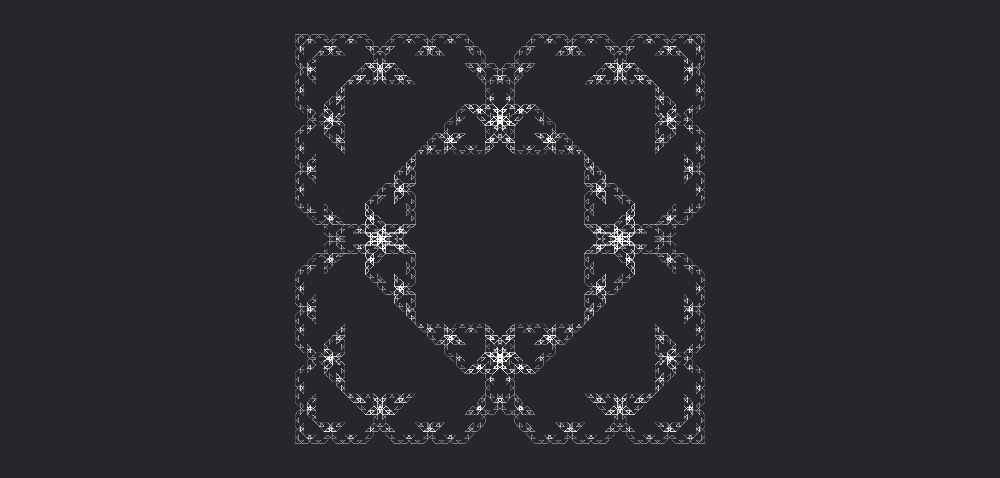

# **Sigillo**

Preserva l'impulso in un luogo fisso, attivabile tramite contatto fisico o con un evocazione.

| **Bersagli primari**   | Nessuno                                   |
| **Bersagli secondari** | Nessuno                                   |
| **Costo base per LV**  | 100 mana                                  |
| **Mod. difesa**        | Nessuno                                   |

## Effetto
Piazza immediatamente un sigillo, che può essere posizionato su una superficie solida o anche sospeso in aria. Il sigillo preserva l'impulso nella posizione specificata. Quando viene attivato (tramite contatto fisico o quando bersaglio di un'evocazione), il sigillo rilascia la forma precedente dell'impulso, permettendo l’esecuzione del suo effetto.

## Modello
- ### Grado 1 
  
- ### Grado 2 
  
- ### Grado 3 
  
- ### Grado 4 
  
- ### Grado 5 
  