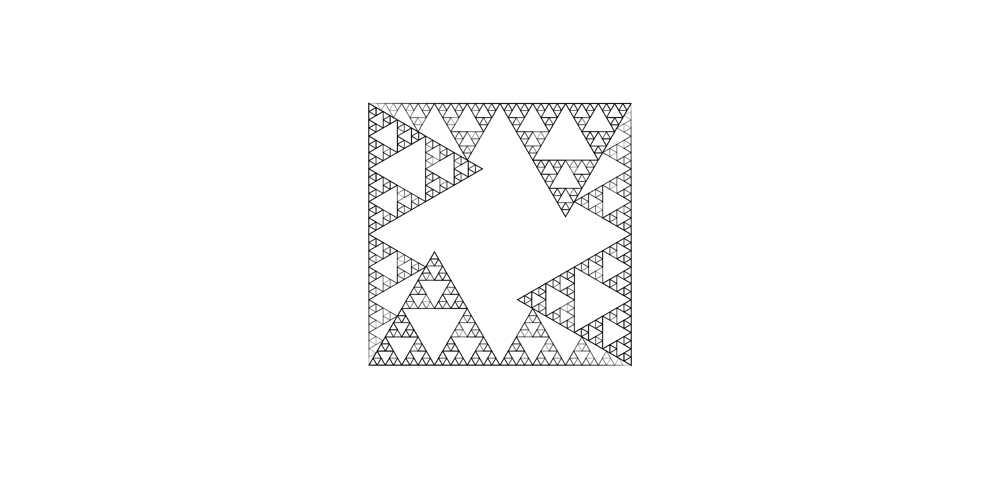

# **Esplosione**

Genera un'esplosione che colpisce ad area, infliggendo danni a tutte le creature presenti nel raggio dell'esplosione.

| **Bersagli primari**   | Centro della sfera                        |
| **Bersagli secondari** | Creature in un'area e non coperte         |
| **Costo base per LV**         | 500 mana                                  |
| **Mod. difesa**        | Nessuno                                   |

## Effetto
Esplode dal punto di origine, infliggendo danni a tutte le creature nel raggio d'azione. L'esplosione ignora eventuali coperture minori, ma non può attraversare ostacoli solidi significativi.

## Qualità

| Grado 0 | Grado 1 | Grado 2 | Grado 3 | Grado 4 | Grado 5 |
|---------|---------|---------|---------|---------|---------|
| Raggio 1m | Raggio 2m | Raggio 3m | Raggio 4m | Raggio 5m | Raggio 6m |

## Modello
- ### Grado 1 
  
- ### Grado 2 
  
- ### Grado 3 
  
- ### Grado 4 
  
- ### Grado 5 
  
