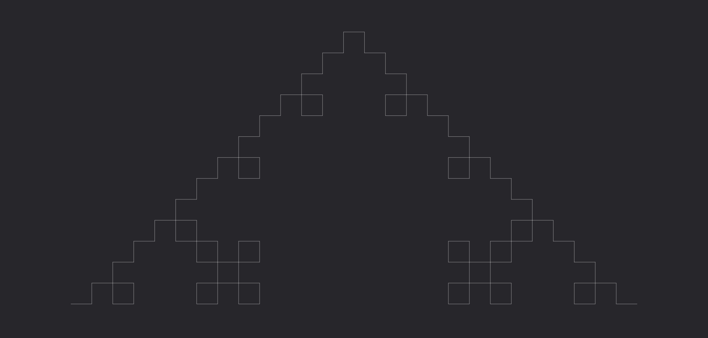
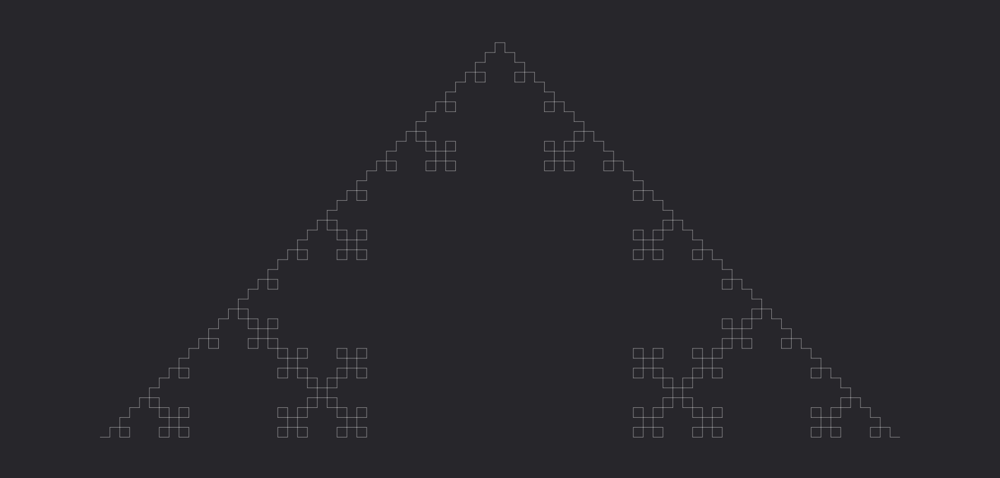
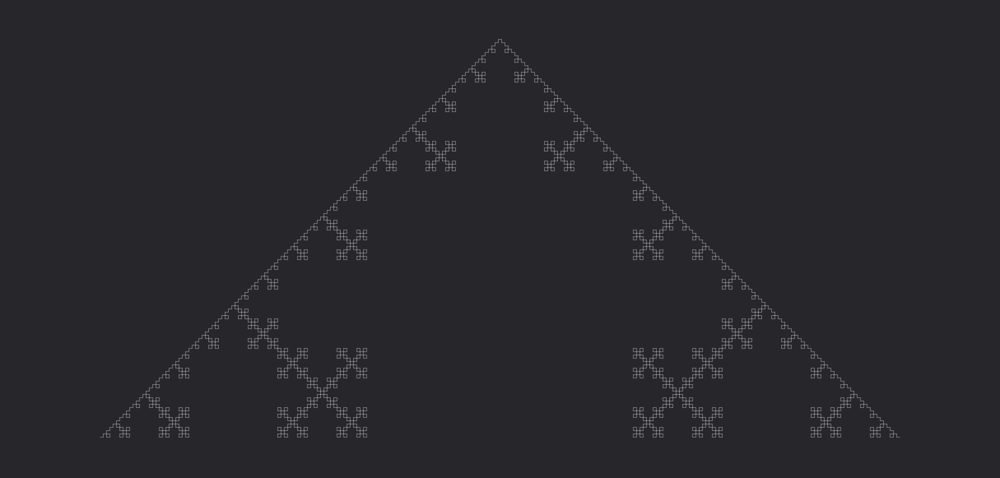

# **Ventaglio**

Colpisce in un arco dal punto di origine, infliggendo danni alle creature all'interno dell'area d'effetto.

| **Bersagli primari**   | Creature al centro del ventaglio          |
| **Bersagli secondari** | Creature nell'area                        |
| **Costo base per LV**  | 300 mana                                  |
| **Mod. difesa**        | Nessuno                                   |

## Effetto
La runa colpisce in un arco che si estende dal punto di origine. L'ampiezza dell'arco e la lunghezza dell'effetto dipendono dal grado della runa. Le creature al centro dell'arco sono considerate bersagli primari, mentre tutte le altre creature all'interno dell'area sono bersagli secondari.

## Qualità

| Grado 0 | Grado 1 | Grado 2 | Grado 3 | Grado 4 | Grado 5 |
|---------|---------|---------|---------|---------|---------|
| Ampiezza 20° Lunghezza 1m | Ampiezza 30° Lunghezza 2m | Ampiezza 40° Lunghezza 3m | Ampiezza 50° Lunghezza 4m | Ampiezza 60° Lunghezza 5m | Ampiezza 70° Lunghezza 6m |

## Modello
- ### Grado 1 
  
- ### Grado 2 
  
- ### Grado 3 
  
- ### Grado 4 
  
- ### Grado 5 
  
