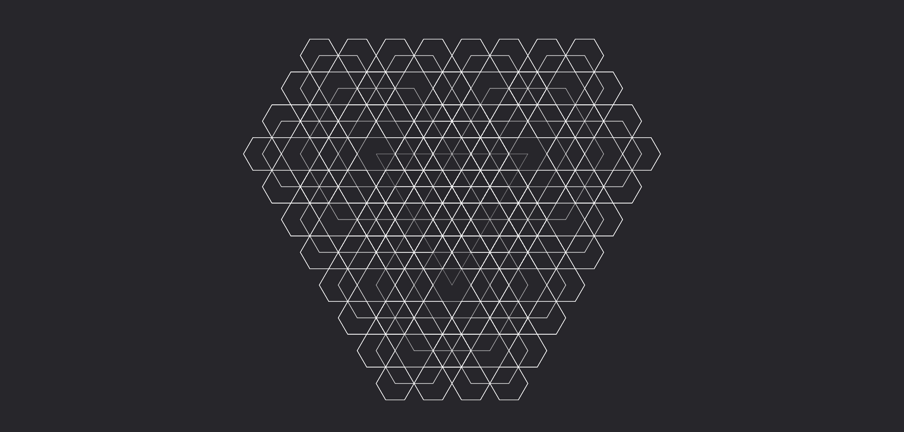

# **Raggio maggiore**

Lancia un raggio ampio che colpisce tutte le creature lungo la sua traiettoria e quelle vicine al percorso.

| **Bersagli primari**   | Creature nella traiettoria del raggio     |
| **Bersagli secondari** | Creature entro 1m dalla traiettoria       |
| **Costo base per LV**  | 800 mana                                  |
| **Mod. difesa**        | Nessuno                                   |

## Effetto
La runa genera un raggio che si propaga in linea retta, colpendo tutte le creature che si trovano direttamente lungo il suo percorso. Il raggio continua finché non incontra un ostacolo solido significativo. Le creature entro 1 metro dalla traiettoria del raggio sono considerate bersagli secondari e subiscono l’effetto del raggio.

## Qualità

| Grado 0 | Grado 1 | Grado 2 | Grado 3 | Grado 4 | Grado 5 |
|---------|---------|---------|---------|---------|---------|
| Gittata 10m | Gittata 20m | Gittata 30m | Gittata 40m | Gittata 50m | Gittata 60m |

## Modello
- ### Grado 1 
  
- ### Grado 2 
  
- ### Grado 3 
  
- ### Grado 4 
  
- ### Grado 5 
  