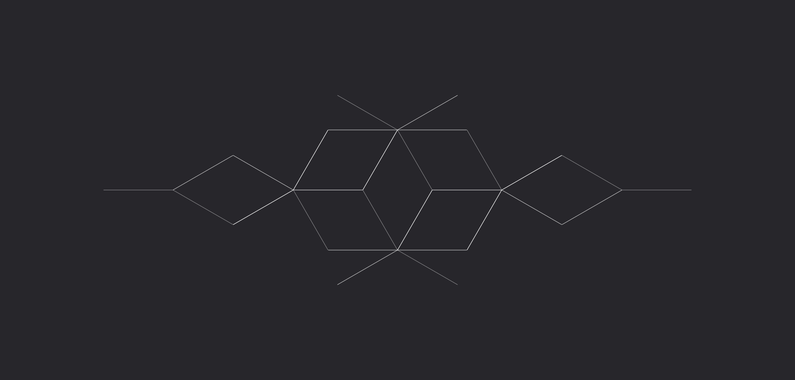
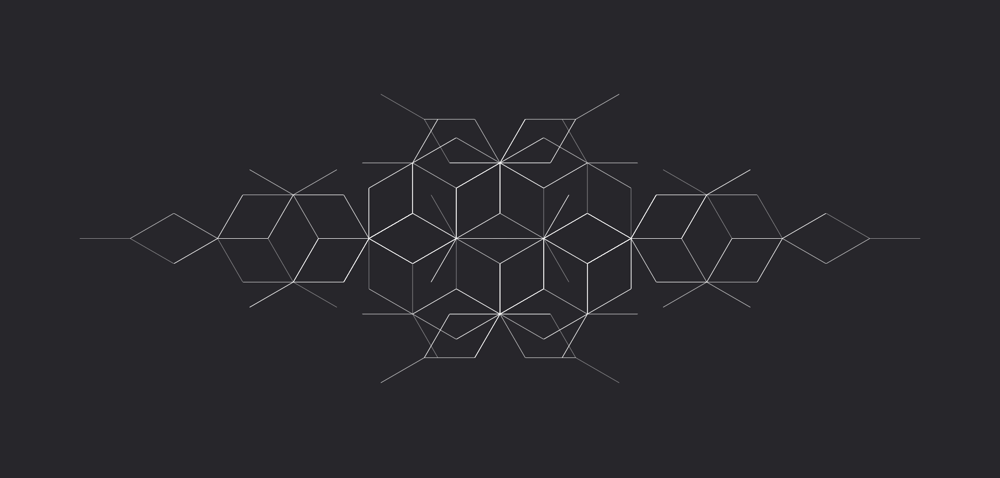
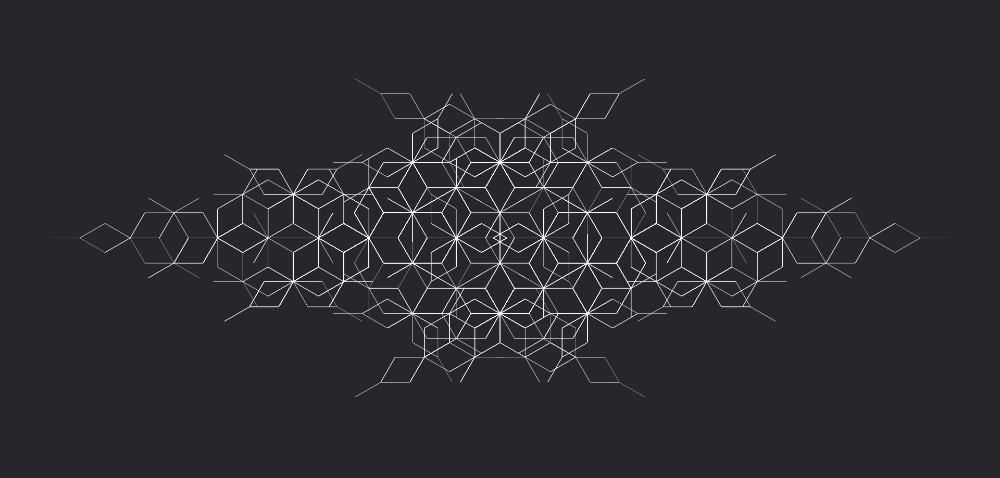
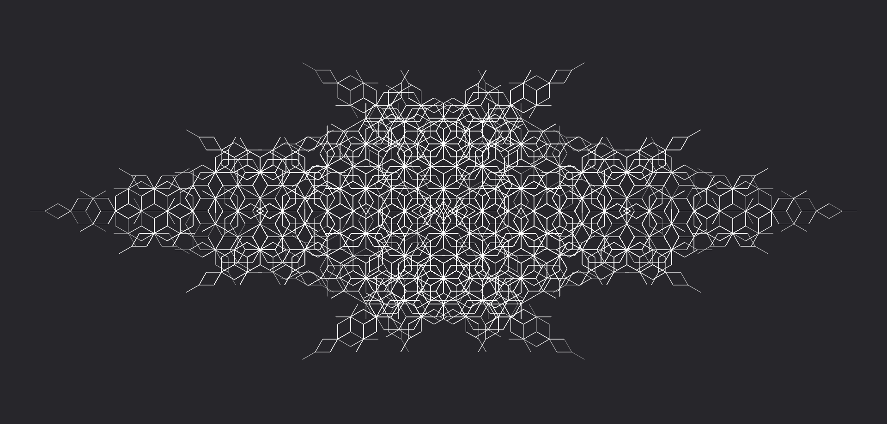

# **Corruzione**

Trasforma il flusso in un'energia malefica che infligge danni puri e corrompe il mana dei bersagli, causando effetti debilitanti.

| **Tipo di danno**      | Puro                                      |
| **Danni per LV**       | 2                                         |
| **Costo base per LV**  | 800 mana                                  |

## Effetto
L'evocazione si manifesta come un'energia oscura e corruttrice, infliggendo danni puri e causando corruzione del mana nelle creature colpite.  
- **Bersagli primari**: Per ogni LV dell'evocazione subiscono 2 danni puri e 2 livelli di corruzione. Se superano un tiro salvezza su COS o ARC (CD 9 + LV) i livelli di corruzione subiti sono dimezzati.
- **Bersagli secondari**: Per ogni LV dell'evocazione subiscono 1 danno puro e 1 livello di corruzione. Se superano un tiro salvezza su COS o ARC (CD 9 + LV) i livelli di corruzione subiti sono dimezzati (arrotondare per difetto).

## Modello
- ### Grado 1 
  
- ### Grado 2 
  
- ### Grado 3 
  
- ### Grado 4 
  
- ### Grado 5 
  
