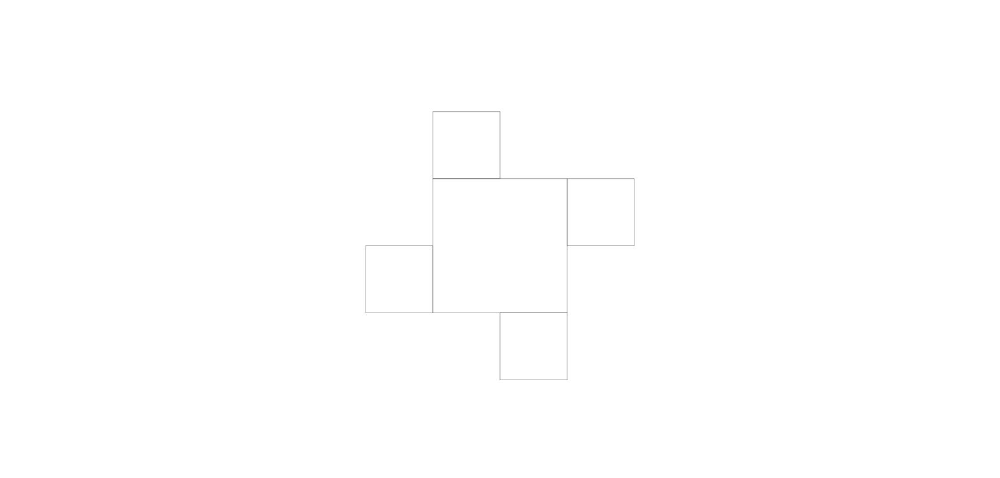
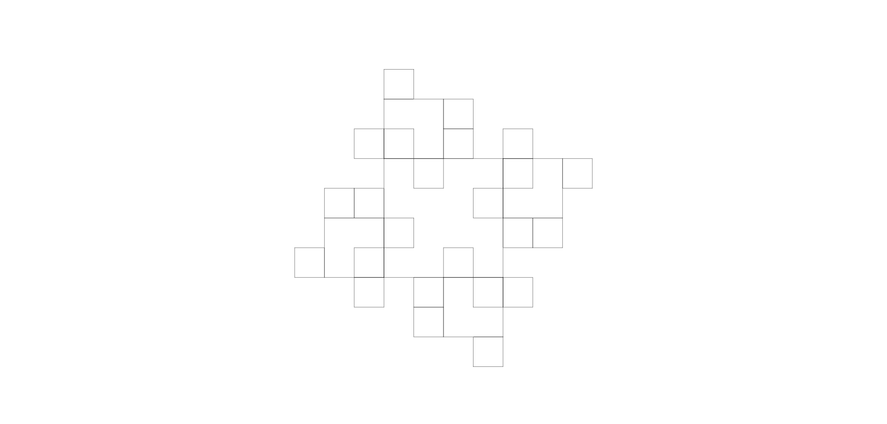
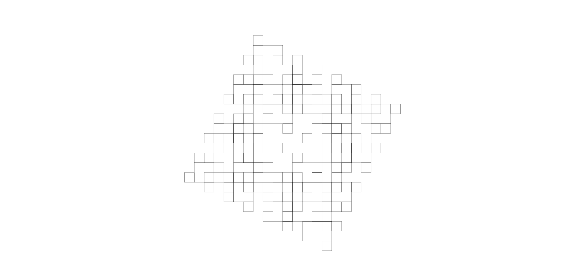
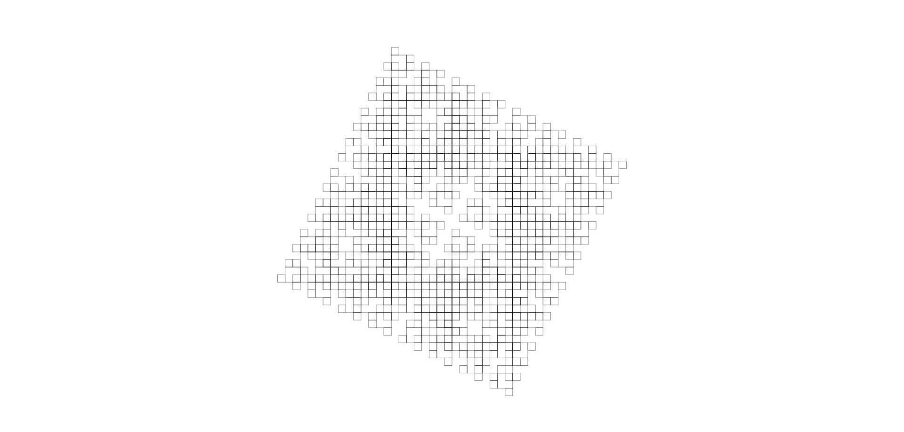
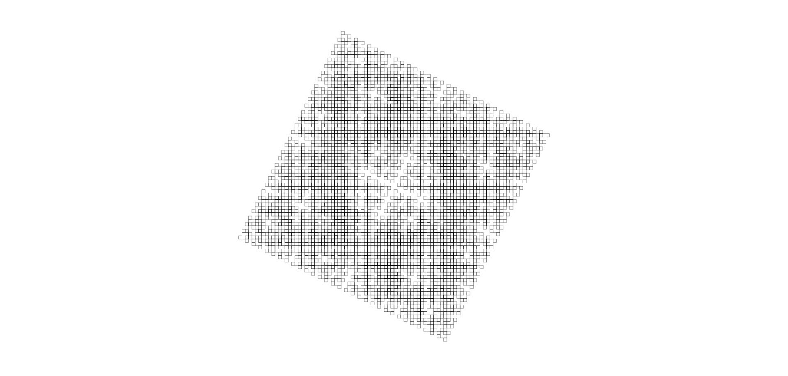

# **Cristallo**

Trasforma il flusso in una sostanza solida e trasparente come il cristallo, in grado di stordire i bersagli e creare formazioni cristalline permanenti al contatto con superfici solide.

| **Tipo di danno**      | Impatto                                   |
| **Danni per LV**       | 2                                         |
| **Costo base per LV**  | 700 mana                                  |

## Effetto
L'evocazione assume l'aspetto di un cristallo massiccio, infliggendo danni da impatto e applicando l'effetto di stordimento alle creature colpite. Se l'evocazione colpisce una superficie solida, genera un cristallo alto 1 metro con punti vita (PV) pari a 5 volte il LV dell'evocazione.  
- **Bersagli primari**: Per ogni LV dell'evocazione subiscono 2 danni da impatto e 1 livello di stordimento. Se superano un tiro salvezza su COS o ARC (CD 7 + LV) i livelli di stordimento subiti sono dimezzati.
- **Bersagli secondari**: Per ogni LV dell'evocazione subiscono 1 danno da impatto. Se falliscono un tiro salvezza su COS o ARC (CD 7 + LV) ricevono 1 livello di stordimento, e non subiscono stordimento se il tiro ha successo.

## Modello
- ### Grado 1 
  
- ### Grado 2 
  
- ### Grado 3 
  
- ### Grado 4 
  
- ### Grado 5 
  
