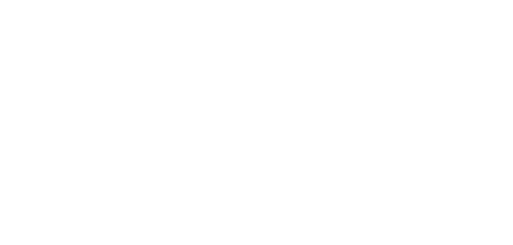
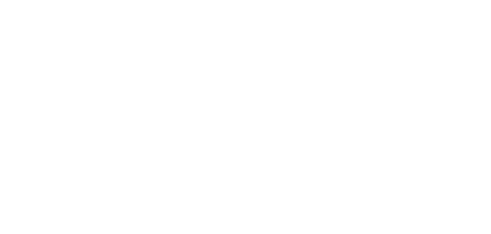
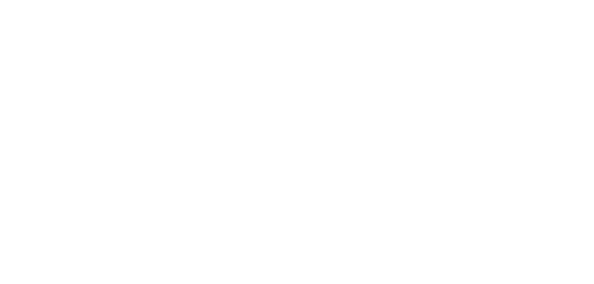

# **Disintegrazione**

Trasforma il mana arcano in un'energia estremamente distruttiva, capace di disintegrare completamente la materia, riducendo bersagli e oggetti in polvere.  
Il possesso e l'utilizzo di questa runa sono **proibiti**.

| **Tipo di danno**      | Magico                                    |
| **Danni per LV**       | 100                                       |
| **Costo base per LV**  | 20000 mana                                |

## Effetto
L'evocazione assume la forma di pura energia disintegrante che annichilisce qualsiasi cosa tocchi. L'evocazione infligge danni puri di altissima intensità, cancellando bersagli e materiali senza lasciare traccie.  
- **Bersagli primari**: Per ogni LV dell'evocazione subiscono 100 danni magici. Qualsiasi creatura che subisce una ferita mortale a causa di questa runa viene completamente disintegrata, lasciando solo polvere.
- **Bersagli secondari**: Per ogni LV dell'evocazione subiscono 50 danni magici.

## Modello
- ### Grado 1 
  
- ### Grado 2 
  
- ### Grado 3 
  
- ### Grado 4 
  
- ### Grado 5 
  
