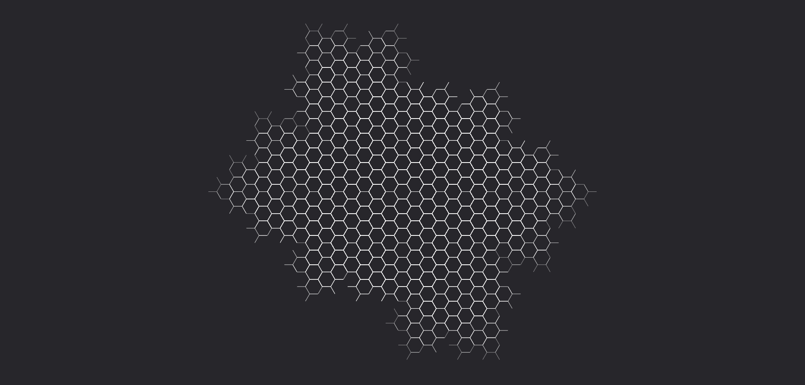

# **Potenziamento**

Trasforma l'evocazione in una sostanza invigorente che potenzia le capacità fisiche e magiche del bersaglio, migliorandone le prestazioni in combattimento e in arcano.

| **Tipo di danno**      | Nessuno                                   |
| **Danni per LV**       | 0                                         |
| **Costo base per LV**  | 800 mana                                  |

## Effetto
L'evocazione si trasforma in una sostanza eterea che rimane attaccata al bersaglio, incrementandone le capacità fisiche e arcane. Sebbene non infligga danni, il bersaglio diventa più forte, veloce e resistente, migliorando sia le capacità fisiche che quelle legate alla magia.  
- **Bersagli primari**: Per ogni LV dell'evocazione il bersaglio riceve 2 livelli di potenziamento.
- **Bersagli secondari**: Per ogni LV dell'evocazione il bersaglio riceve 1 livello di potenziamento.

## Modello
- ### Grado 1 
  
- ### Grado 2 
  
- ### Grado 3 
  
- ### Grado 4 
  
- ### Grado 5 
  
