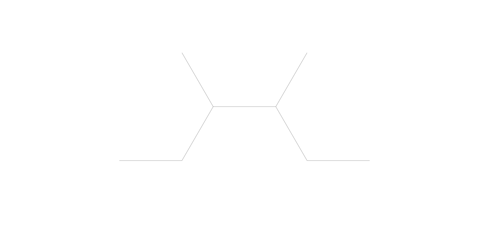

# **Fuoco**

Transforma il flusso in una sostanza estremamente infiammabile, in grado di prendere fuoco al solo contatto con l'aria.

| **Tipo di danno**      | Fuoco                                     |
| **Danni per LV**       | 2                                         |
| **Costo base per LV**  | 200 mana                                  |

## Effetto
L'evocazione ottiene l'aspetto di una fiamma viva, dando fuoco a oggetti infiammabili con cui viene a contatto e infiggendo danni da fuoco alle creature colpite.  
- **Bersagli primari**: Per ogni LV dell'evocazione subiscono 2 danni da fuoco e 1 livello di bruciatura. Se superano un tiro salvezza su COS o ARC (CD 8 + LV) i livelli di bruciatura subiti sono dimezzati.
- **Bersagli secondari**: Per ogni LV dell'evocazione subiscono 1 danno da fuoco. Se falliscono un tiro salvezza su COS o ARC (CD 8 + LV) ricevono livelli di bruciatura pari alla metà del LV dell'evocazione, e non subiscono bruciatura se il tiro ha successo.

## Modello
- ### Grado 1 
  
- ### Grado 2 
  
- ### Grado 3 
  
- ### Grado 4 
  
- ### Grado 5 
  