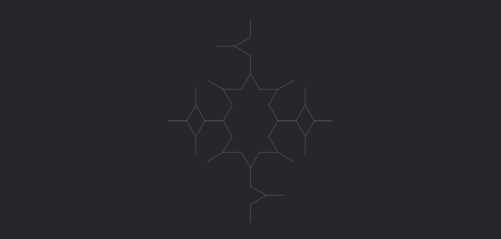
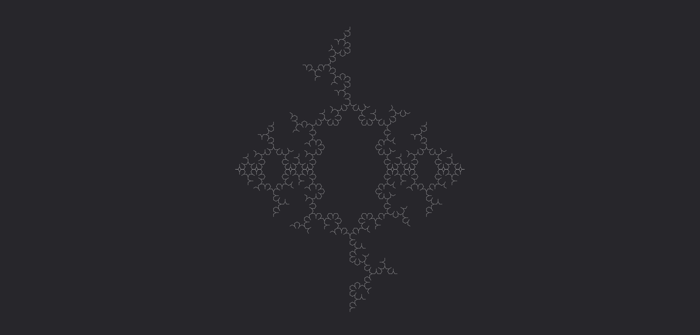

# **Cura**

Trasforma l'impulso in un'energia rigenerante, capace di guarire ferite minori.

| **Tipo di danno**      | Nessuno                                   |
| **Danni per LV**       | Nessuno                                   |
| **Costo base per LV**  | 300 mana                                  |

## Effetto
L'evocazione prende la forma di un vortice di energia curativa, ripristinando i PS dei bersagli colpiti.  
- **Bersagli primari**: Per ogni LV dell'evocazione recuperano 2 PS.
- **Bersagli secondari**: Per ogni LV dell'evocazione recuperano 1 PS.

## Modello
- ### Grado 1 
  
- ### Grado 2 
  
- ### Grado 3 
  
- ### Grado 4 
  
- ### Grado 5 
  
