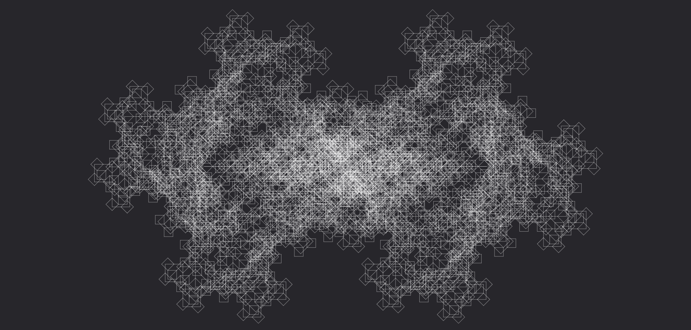

# **Morte**

Trasforma il flusso in un'energia letale e inesorabile, capace di infliggere danni puri devastanti e decretare la fine definitiva dei bersagli.

| **Tipo di danno**      | Puro                                      |
| **Danni per LV**       | 10                                        |
| **Costo base per LV**  | 5000 mana                                 |

## Effetto
L'evocazione si manifesta come un potere letale che corrode i bersagli dall'interno, distruggendo organi e tessuti vitali. I danni inflitti da questa runa non colpiscono solo la superficie, ma causano un forte deterioramento interno che può risultare fatale.  
Se un bersaglio subisce una ferita mortale per effetto di questa runa, muore immediatamente.
- **Bersagli primari**: Per ogni LV dell'evocazione subiscono 10 danni puri. Se subiscono una ferita mortale a seguito dei danni inflitti da questa runa, muoiono immediatamente.
- **Bersagli secondari**: Per ogni LV dell'evocazione subiscono 5 danni puri. Se subiscono una ferita mortale a seguito dei danni inflitti da questa runa, muoiono immediatamente.

## Modello
- ### Grado 1 
  
- ### Grado 2 
  
- ### Grado 3 
  
- ### Grado 4 
  
- ### Grado 5 
  