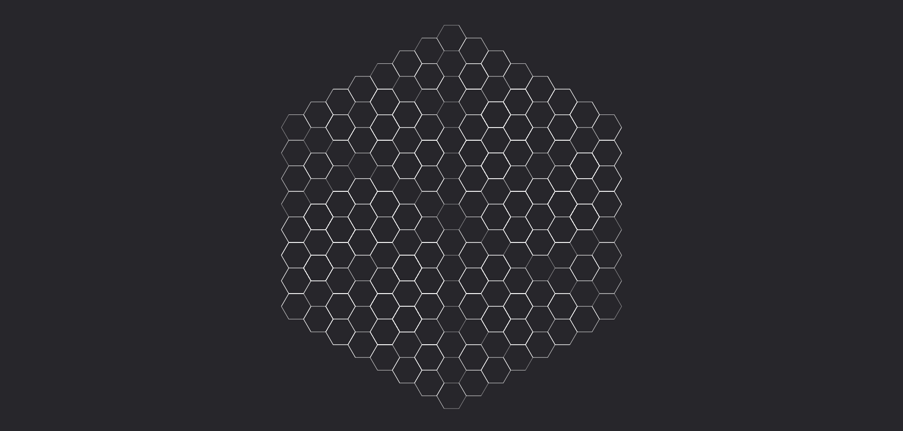
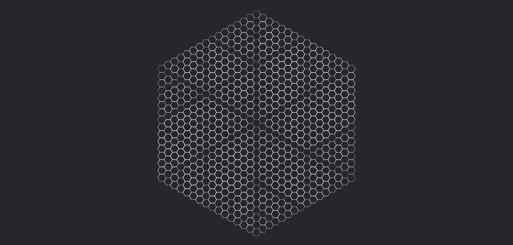

# **Annullamento**

Trasforma il mana in un'energia caotica che disturba l'energia arcana con cui entra a contatto.

| **Tipo di danno**      | Nessuno                                   |
| **Danni per LV**       | 0                                         |
| **Costo base per LV**  | 100 mana                                  |

## Effetto
L'evocazione è visibile solo come una debole distorsione ottica, ma i suoi effetti sono devestanti per qualunque forma di energia arcana. L'energia sprigionata da questa runa è di natura così caotica che un costrutto di mana che ci interagisce si dissolve istantaneamente e ritorna a uno stato di mana grezzo.   
- **Bersagli primari**: I bersagli perdono il controllo di tutti i nuclei arcani che possiedono, e le evocazioni bersagliate di livello pari o inferiore a questa vengono istantaneamente annullate.
- **Bersagli secondari**: I bersagli perdono il controllo di tutti i nuclei arcani che possiedono, e le evocazioni bersagliate di livello pari o inferiore alla metà del livello di questa (approssimato per difetto) vengono istantaneamente annullate.

## Modello
- ### Grado 1 
  
- ### Grado 2 
  
- ### Grado 3 
  
- ### Grado 4 
  
- ### Grado 5 
  