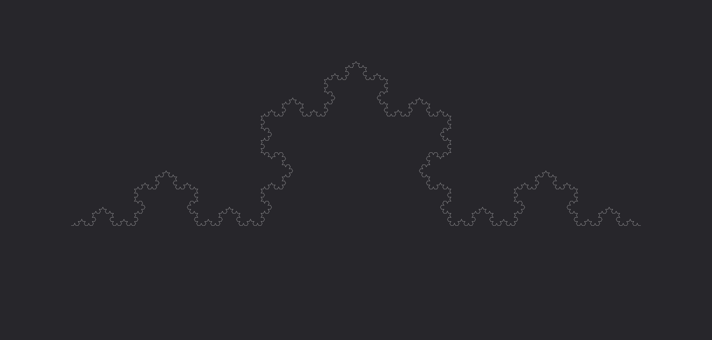

# **Freccia**

Trasforma l'impulso in un'energia affilata e perforante, capace di causare danni profondi ai bersagli colpiti.

| **Tipo di danno**      | Perforante                                |
| **Danni per LV**       | 2                                         |
| **Costo base per LV**  | 200 mana                                  |

## Effetto
L'evocazione prende la forma di una freccia energetica affilata, infliggendo danni perforanti e causando sanguinamento nelle creature colpite.  
- **Bersagli primari**: Per ogni LV dell'evocazione subiscono 2 danni perforanti e 1 livello di sanguinamento. Se superano un tiro salvezza su COS (CD 9 + LV) i livelli di sanguinamento subiti sono dimezzati.
- **Bersagli secondari**: Per ogni LV dell'evocazione subiscono 1 danno perforante. Se falliscono un tiro salvezza su COS (CD 9 + LV) ricevono 1 livello di sanguinamento, e non subiscono sanguinamento se il tiro ha successo.

## Modello
- ### Grado 1 
  
- ### Grado 2 
  
- ### Grado 3 
  
- ### Grado 4 
  
- ### Grado 5 
  