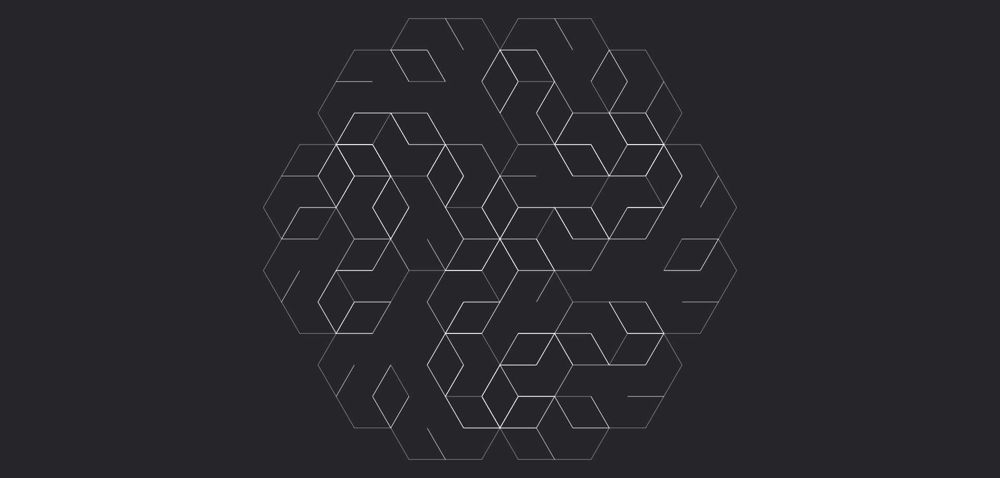
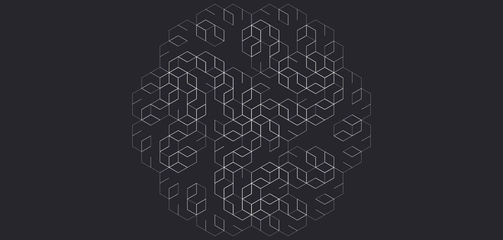

# **Spinta**

Trasforma il flusso in un'onda di energia cinetica, capace di spostare i bersagli e infliggere danni da impatto.

| **Tipo di danno**      | Impatto                                   |
| **Danni per LV**       | 2                                         |
| **Costo base per LV**  | 400 mana                                  |

## Effetto
L'evocazione assume la forma di un'onda di energia che spinge via i bersagli colpiti, infliggendo danni da impatto e spostandoli.  
- **Bersagli primari**: Per ogni LV dell'evocazione subiscono 2 danni da impatto. Se falliscono un tiro salvezza su COS o ARC (CD 9 + LV), vengono spostati di 1 metro per ogni LV dell'evocazione. Gli oggetti inanimati vengono spostati se il loro peso è inferiore a (10 * LV) kg.
- **Bersagli secondari**: Per ogni LV dell'evocazione subiscono 1 danno da impatto. Se falliscono un tiro salvezza su COS o ARC (CD 9 + LV), vengono spostati di 1 metro, e non subiscono spostamento se il tiro ha successo. Gli oggetti inanimati vengono spostati se il loro peso è inferiore a (5 * LV) kg.

## Modello
- ### Grado 1 
  
- ### Grado 2 
  
- ### Grado 3 
  
- ### Grado 4 
  
- ### Grado 5 
  