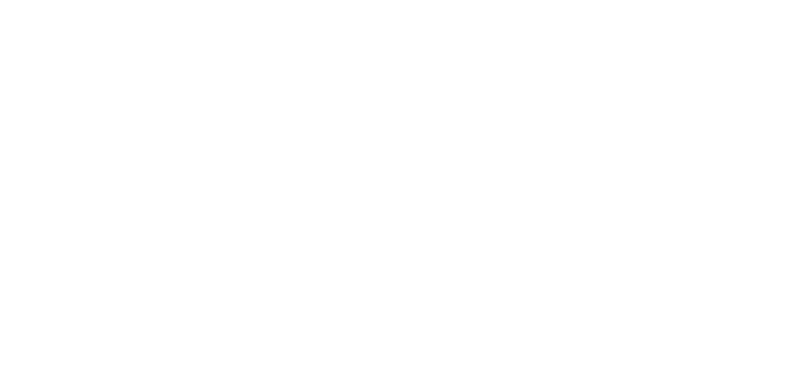
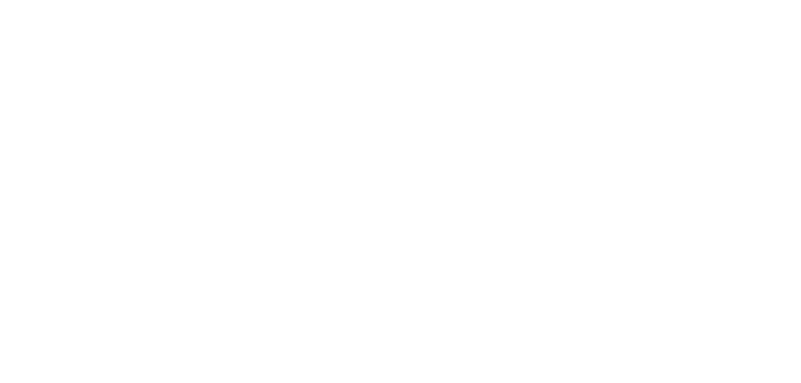
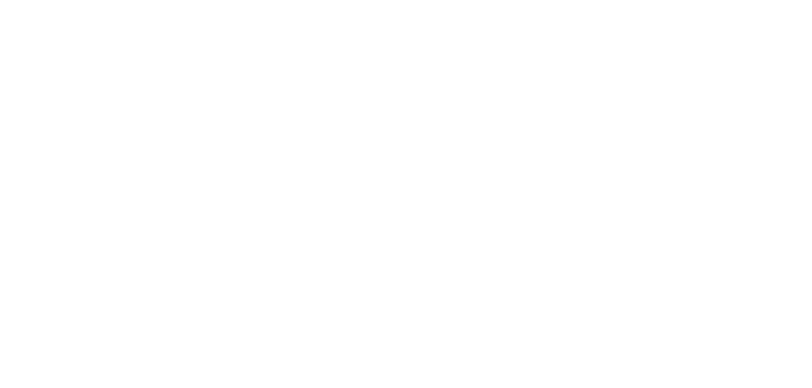
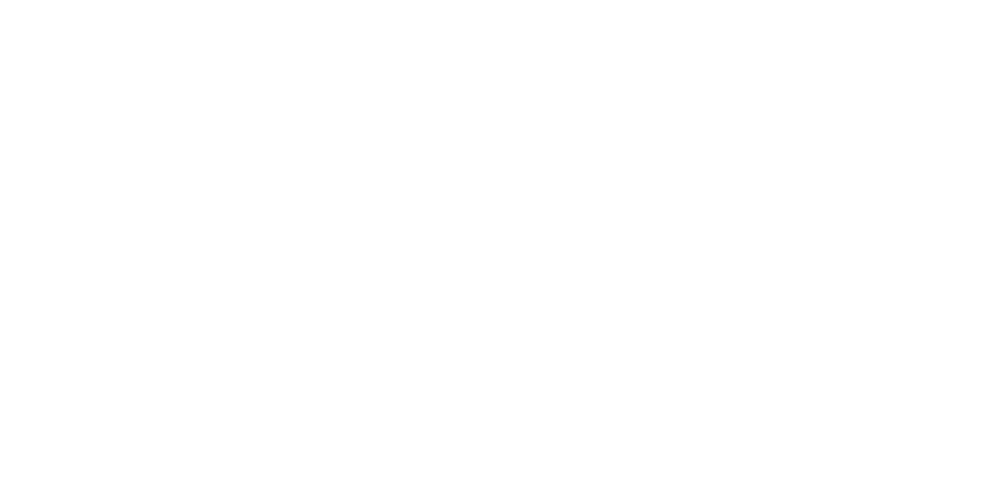

# **Rigenerazione**

Trasforma l'impulso arcano in un’energia di guarigione completa e profonda, in grado di riportare il bersaglio al pieno stato di salute e di guarire condizioni critiche.

| **Tipo di danno**      | Nessuno                                   |
| **Danni per LV**       | 0                                         |
| **Costo base per LV**  | 2000 mana                                 |

## Effetto
L'impulso arcano si trasforma in una forza rigeneratrice intensa, capace di ripristinare completamente i punti salute del bersaglio e di rimuovere ferite mortali.  
- **Bersagli primari**: Il bersaglio recupera completamente i suoi punti salute (PS) e, se possiede uno stato di ferita mortale, questo viene rimosso immediatamente.
- **Bersagli secondari**: Il bersaglio recupera la metà dei suoi PS massimi.

## Modello
- ### Grado 1 
  
- ### Grado 2 
  
- ### Grado 3 
  
- ### Grado 4 
  
- ### Grado 5 
  
