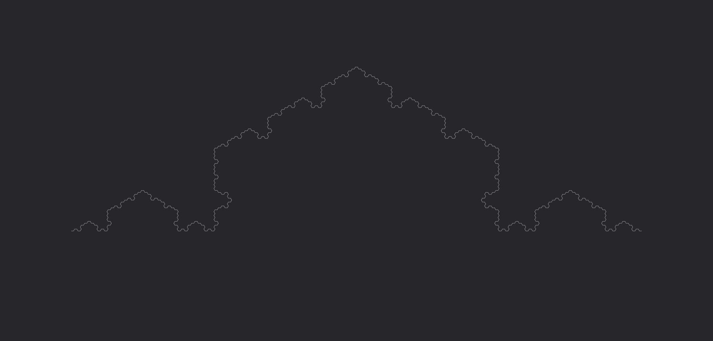
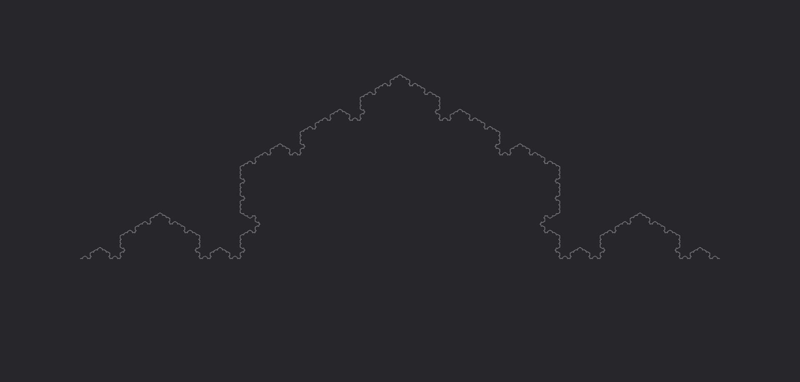

# **Lama**

Trasforma l'impulso in un'energia affilata come una lama, capace di generare tagli netti e infliggere ferite profonde nelle creature colpite.

| **Tipo di danno**      | Taglio                                    |
| **Danni per LV**       | 2                                         |
| **Costo base per LV**  | 200 mana                                  |

## Effetto
L'evocazione prende la forma di una lama di energia tagliente, infliggendo danni da taglio e causando sanguinamento nelle creature colpite.  
- **Bersagli primari**: Per ogni LV dell'evocazione subiscono 2 danni da taglio e 1 livello di sanguinamento. Se superano un tiro salvezza su COS (CD 9 + LV) i livelli di sanguinamento subiti sono dimezzati.
- **Bersagli secondari**: Per ogni LV dell'evocazione subiscono 1 danno da taglio. Se falliscono un tiro salvezza su COS (CD 9 + LV) ricevono 1 livello di sanguinamento, e non subiscono sanguinamento se il tiro ha successo.

## Modello
- ### Grado 1 
  
- ### Grado 2 
  
- ### Grado 3 
  
- ### Grado 4 
  
- ### Grado 5 
  
